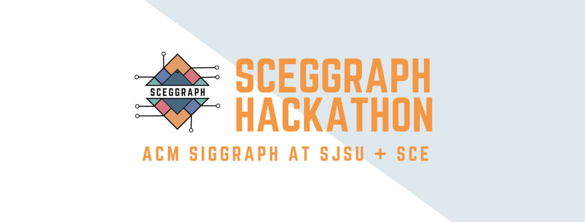

  
 
# SCEGGRAPH Hackathon: Project Name Here
Remote hackathon held from 1/8/21-1/10/21 for SJSU students, hosted by ACM SIGGRAPH Student Chapter and SCE of SJSU. 
 
## **Objective** 
The purpose of this project is to develop a new way of connecting people virtually. This project is only for fun and educational purposes.
 
## **Project Team Members** 
**Vincent Saw** - [GitHub](https://github.com/vsawce) | [LinkedIn](https://www.linkedin.com/in/vincent-saw-810361162/) 
**Christopher Tom** - [GitHub](https://github.com/Christopher-Tom) | [LinkedIn](https://www.linkedin.com/in/christopher-tom/) 
 
## **Demonstrations** 
-> Screenshots, etc go here 
 
## **Tech/Framework** 
-> List of libraries, frameworks, etc used go here 
 
## **Quick Links** 
[Hackathon Page](https://sceggraph.devpost.com/) 
 
## **License** 
 
This project utilizes the MIT License. 
*MIT © Vincent Saw and Christopher Tom* 
