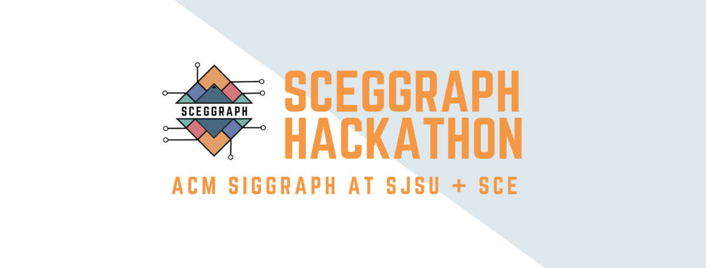
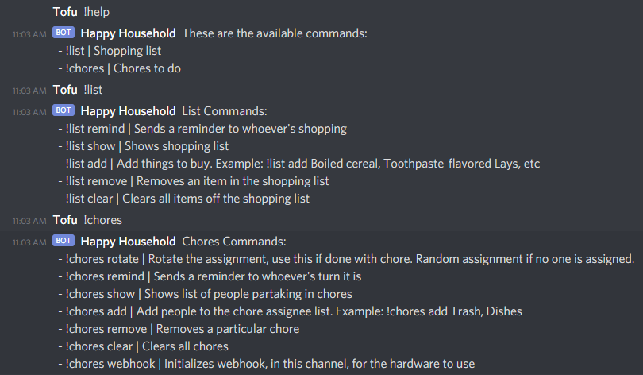
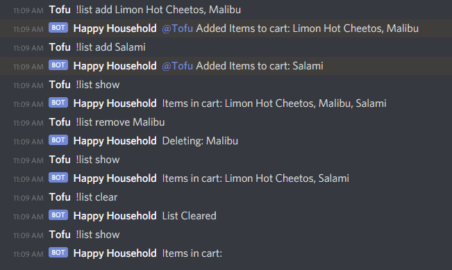
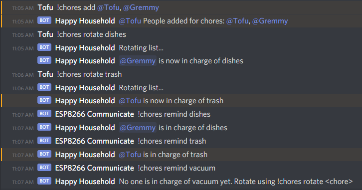
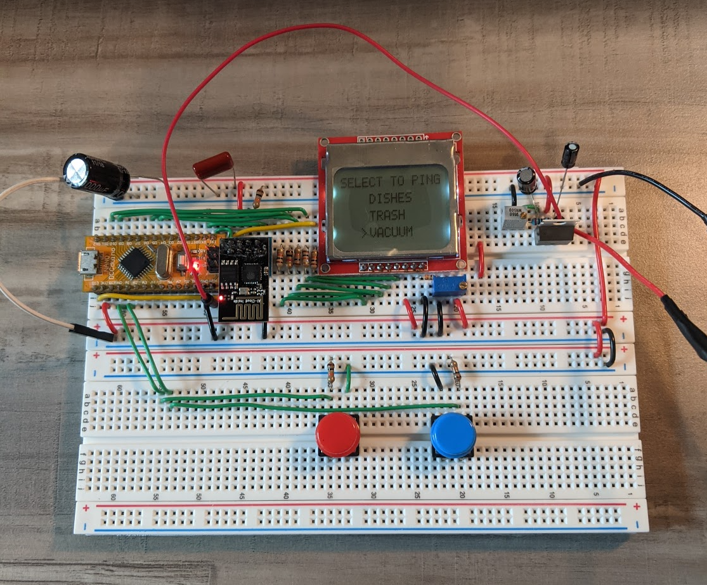

  
 
# SCEGGRAPH Hackathon: Happy Household
Remote hackathon held from 1/8/21-1/10/21 for SJSU students, hosted by ACM SIGGRAPH Student Chapter and SCE of SJSU. 
## Description
The purpose of Happy Household was to develop a better way of connecting people through virtual means: we aimed to solve some common issues that arise among those living in the same household. 
One such issue is keeping track of whose turn it is to take out the trash. Solving this issue is especially helpful in households or dorms with multiple roommates and also encourages a fair and balanced chore routine. 
 
Another one of these issues includes a disorganized shopping list. When someone goes out to shop or buy food for the household, there is a potential for forgetting certain items due to the messy nature of how these 
situations are typically handled; some examples of this messy nature include how certain requests can be drowned out by irrelevant text history and also simply the lack of a written medium to store the shopping list. 
 
Happy Household helps to centralize helpful household data on the cloud that can be simulataneously accessed by multiple people through Discord, and can be arguably more effective in connecting people compared to traditional means. 
Happy Household is also designed with IoT integration in mind, having developed a prototype for a wireless embedded system that can interact with the Discord bot only with a USB 5v power supply and WiFi. 

## Project Team Members
**Vincent Saw** - [GitHub](https://github.com/vsawce) | [LinkedIn](https://www.linkedin.com/in/vincent-saw-810361162/) 
**Christopher Tom** - [GitHub](https://github.com/Christopher-Tom) | [LinkedIn](https://www.linkedin.com/in/christopher-tom/) 
## Demonstrations
 
 
 
 
[Video demonstration of the wireless embedded system](https://photos.app.goo.gl/xRHRcCGVzfJfgxV27) 
## Tech/Framework
* [Node.js](https://nodejs.org/en/) - Selected JS environment for Discord bot development  
* [Discord.js](https://discord.js.org/#/) - Discord bot API  
* [AVR-Libc](https://www.nongnu.org/avr-libc/) - Main, SPI, UART, buttons, and Nokia 5110 Driver  
* [ESP8266 Arduino Library](https://github.com/esp8266/Arduino#installing-with-boards-manager) - ESP-01 WiFi Driver  

## Quick Links
[SCEGGRAPH Hackathon Page](https://sceggraph.devpost.com/) 
[Discord.js Guide](https://discordjs.guide/) 
[ATMega328p Datasheet](http://ww1.microchip.com/downloads/en/DeviceDoc/Atmel-7810-Automotive-Microcontrollers-ATmega328P_Datasheet.pdf) 
[Nokia 5110 Datasheet](https://www.sparkfun.com/datasheets/LCD/Monochrome/Nokia5110.pdf) 
[ESP8266 ESP-01 Datasheet](http://www.microchip.ua/wireless/esp01.pdf) 
## License
 
This project utilizes the MIT License. 

*Copyright © 2021 Vincent Saw and Christopher Tom* 
 
*Permission is hereby granted, free of charge, to any person obtaining a copy of this software and associated documentation files (the "Software"),
to deal in the Software without restriction, including without limitation the rights to use, copy, modify, merge, publish, distribute, sublicense,
and/or sell copies of the Software, and to permit persons to whom the Software is furnished to do so, subject to the following conditions:* 
 
*The above copyright notice and this permission notice shall be included in all copies or substantial portions of the Software.* 
 
*THE SOFTWARE IS PROVIDED "AS IS", WITHOUT WARRANTY OF ANY KIND, EXPRESS OR IMPLIED, INCLUDING BUT NOT LIMITED TO THE WARRANTIES OF MERCHANTABILITY,
FITNESS FOR A PARTICULAR PURPOSE AND NONINFRINGEMENT. IN NO EVENT SHALL THE AUTHORS OR COPYRIGHT HOLDERS BE LIABLE FOR ANY CLAIM, DAMAGES OR OTHER
LIABILITY, WHETHER IN AN ACTION OF CONTRACT, TORT OR OTHERWISE, ARISING FROM, OUT OF OR IN CONNECTION WITH THE SOFTWARE OR THE USE OR OTHER DEALINGS 
IN THE SOFTWARE.* 
